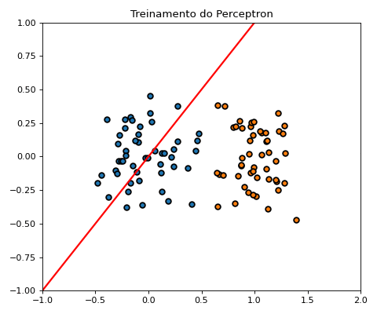

# Perceptron
> Códigos gerados durante a confecção do post sobre Perceptron Simples. Códigos para geração de GIFs que ilustram o treinamento de uma EPOCH do algoritmo do Perceptron.
  
## Comportamento da superfície de separação do Perceptron Simples durante o treinamento:

