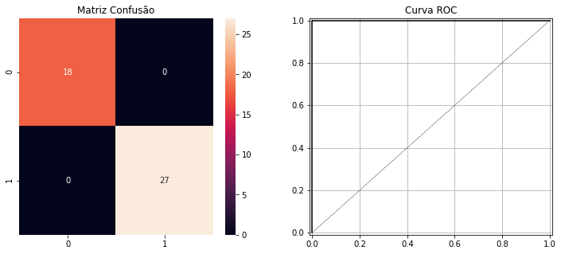
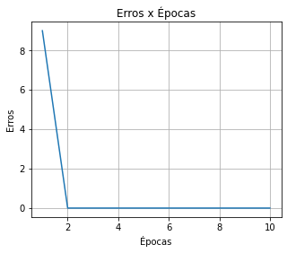
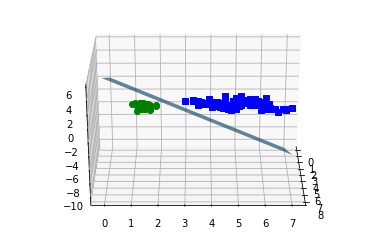
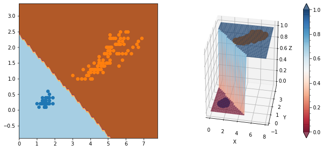

# Perceptron
> Códigos gerados durante a confecção do post de Aplicação do Perceptron Simples. Códigos para desenvolvimento do algoritmo do Perceptron, análise básica da base de dados Íris e aplicação do classificador.
  
## Resultados do Classificador:

  

  

## Hiperplano de Separação Considerando 3 Features:

  

## Superfície de Separação Considerando 2 Features:

  

