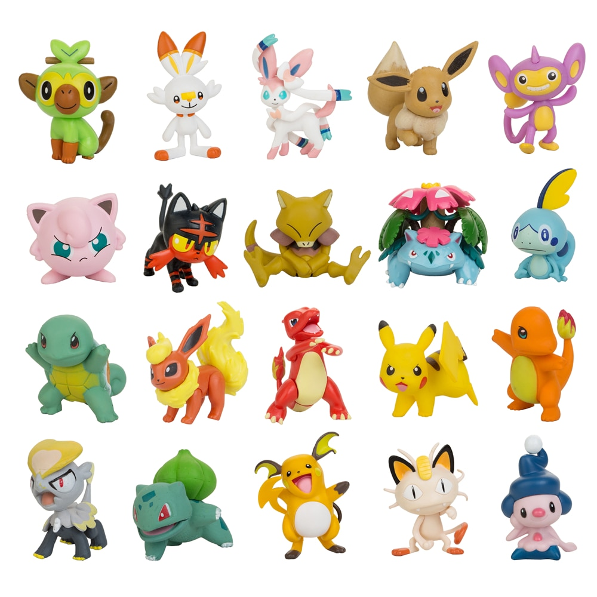
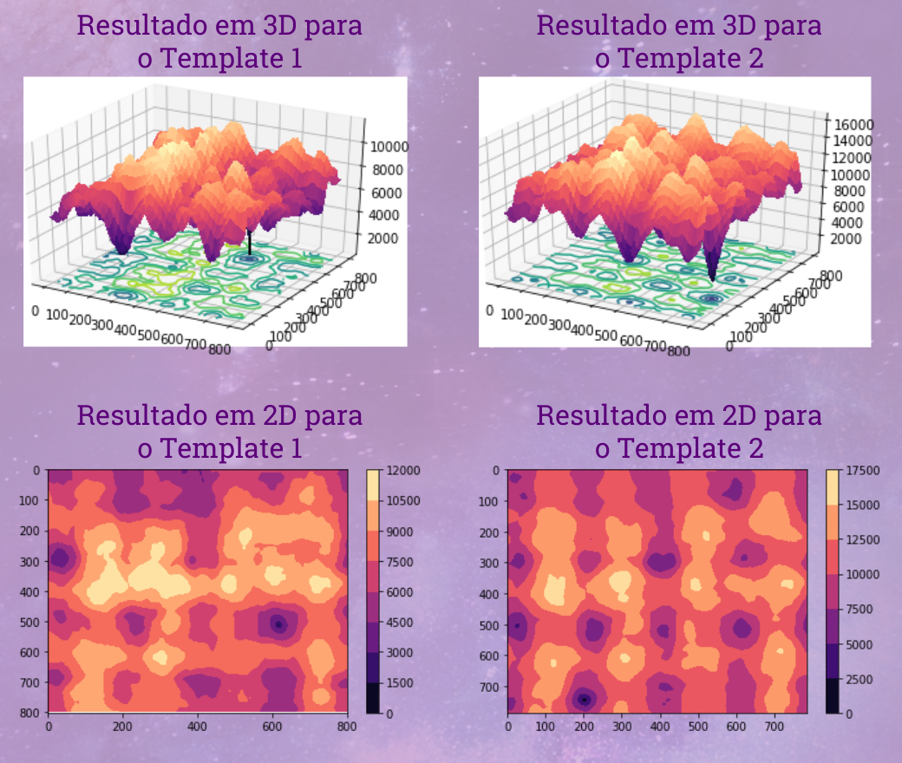
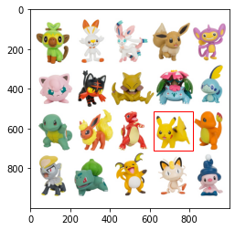
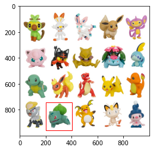

# Perceptron
> Códigos gerados durante a confecção do post sobre Template Matching. 

Template Matching é uma técnica de processamento de imagem digital para encontrar pequenas partes de uma imagem que correspondam a uma imagem de modelo (template).
 
Uma abordagem para lidar com esse problema é deslizar o template sobre a imagem de entrada comparando porções dessa imagem ao template. Diversas estratégias podem ser utilizadas para essa comparação, uma delas é utilizar a soma de diferenças absolutas da intensidade dos pixels das imagens. Assim a porção da imagem que resultar na soma de diferenças absolutas mínima, deverá ser a porção correspondente ao template.

Alguns exemplos de aplicações são: detectar características específicas em imagens muito grandes, auxiliar na navegação de robôs e monitoramento em linhas de produção.

Nesse exeplo essa técnica foi utilizada para identificar 2 pokemons em uma imagem maior.
  
## Imagen de Entrada:

  

## Templates

 

## Resultados:

  

 

