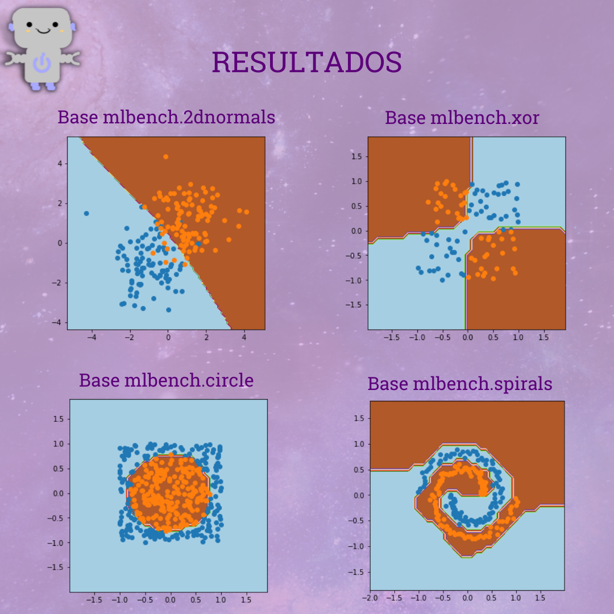
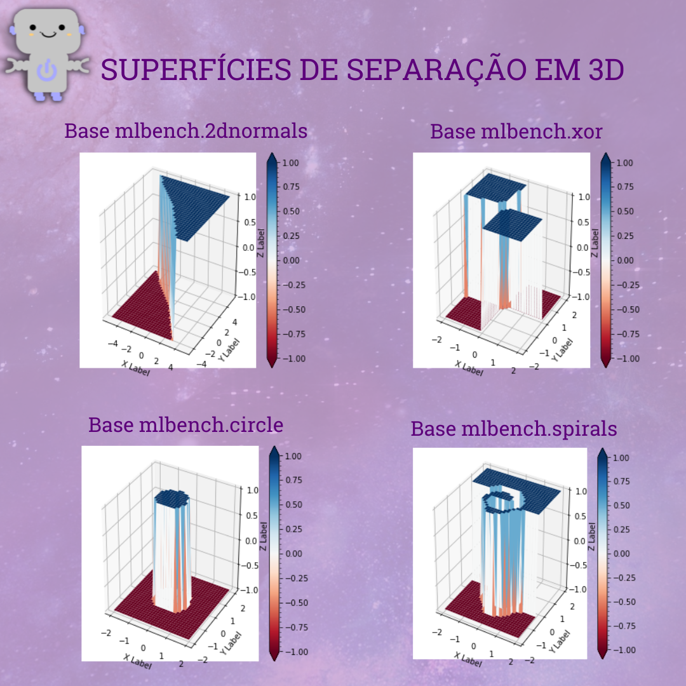

# Extreme Learning Machines
> Códigos gerados durante a confecção do post sobre Extreme Learning Machines. 

ELMs são redes neurais feedforward normalmente utilizadas para classificação e regressão. Essas redes contêm tipicamente uma única camada escondida e os pesos desta são definidos aleatoriamente.

TREINAMENTO:

Uma técnica de treinamento tipicamente aplicada às ELMs está descrita abaixo:

1. Gerar uma matriz de pesos aleatórios de entrada Z.
2. Calcular a matriz de mapeamento H (saída da camada escondida), tal que H = h(XZ).
3. Calcular os pesos da camada de saída, W=H°Y, sendo H° a pseudo-inversa de H.

VANTAGENS:

- Algoritmo de fácil desenvolvimento e aplicação.

- Treinamento mais simples que o das redes neurais normais.

- Pode ser aplicado tanto a problemas binários quanto a problemas com mais de 2 classes.

## Resultados:

  

  

