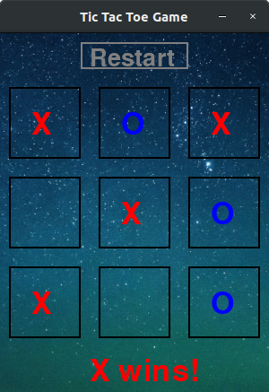

# Q-Learning Agents Playing Tic Tac Toe
> This code creates a tic-tac-toe game with a reinforcement learning agents that learn to play the game. The agent is implemented using a Q-learning algorithm. The Agent class contains methods for encoding the state of the game, selecting actions based on an epsilon-greedy policy, updating the Q-values, and saving/loading the Q-table. The Game class contains methods for resetting the game, checking for a winner, and making a move. It also includes methods for initializing a Pygame GUI and drawing the board.

The Agent class uses a Q-table to store the values of each state-action pair. The state is compressed into a single number using the encode_state method. The choose_action method selects the next action based on the current state and an epsilon-greedy policy. The update_Q method updates the Q-value for the current state-action pair based on the reward received and the maximum Q-value of the next state. The save_q_table and load_q_table methods are used to save and load the Q-table.

The Game class initializes the game board with an empty 3x3 grid. The reset_game method resets the board to its initial state. The check_win method checks if there is a winner or if the game is tied. The play_move method makes a move on the board.

The draw_board_gui method uses Pygame to draw the game board on the screen. The screen is initialized with a window size of 300x400. The board is drawn with black lines and white spaces. The X and O marks are drawn in red and blue, respectively. The font is used to display the winner and the player's turn. We can see the game board on the figure below.

  

The function **train_two_agents** trains two agents to play a game of Tic Tac Toe against each other. The function takes three arguments: *agent_1* and *agent_2*, which are objects representing the two agents, and *episodes*, which is the number of games the agents will play against each other.

The function begins by creating a new instance of the Game class and assigning the agents to play as X and O. For each episode, the function resets the game. It also randomly selects which agent will play first. Then, The function then enters a while loop that continues until the game is over. During each iteration of the loop, the agent whose turn it is chooses a move to play and updates its Q-table based on the current state of the game board. If the game is over, the function updates the Q-tables of both agents based on the outcome of the game and breaks out of the loop.

